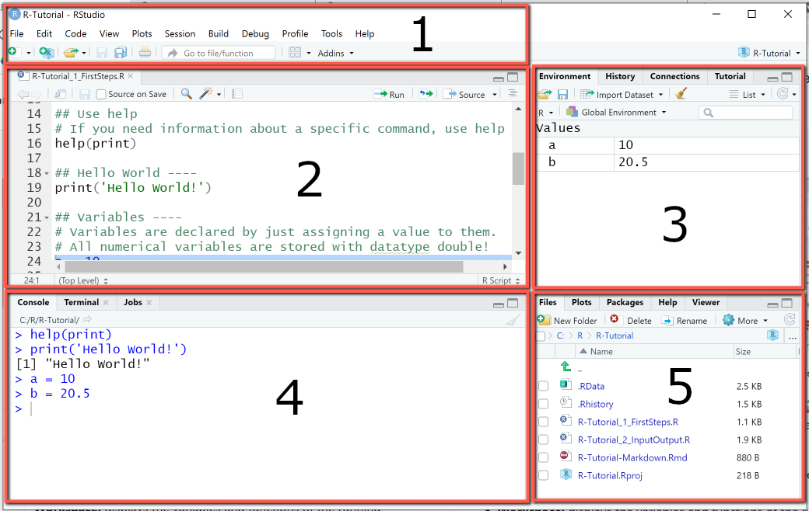

---
editor_options:
  markdown:
    wrap: sentence
---

# Basic R

## Note

This portion of the guide is intended to present you the basics of R to get you up and running.\
However, this is not meant to give you all the guidance and know-how, as well as answer all your questions.
There are plenty of internet tutorials already that answer more specific and basic questions.\
I'll provide a few links at the end that complement what I'll show you here.

## What is R and RStudio

From their own website, simply put "R is a language and environment for statistical computing and graphics.".\
So R is a programming language, just like Python, Matlab or even the syntax you find in SPSS.
This language is particularly driven towards mathematical operations and thus proves quite useful when it comes to data management and analysis.
Importantly, its an expansive (things keep getting added all the time) and open-source (the code is freely available).

As for RStudio, it is an interface for this programming language.
Simply put, it makes working with R easier and everyone (in general) uses this interface to code in R.
When you install R it already installs a very basic editor that lets you do some stuff, but RStudio is way more convening for everything other than simple calculations.
You can see the basic R editor as Textpad (or Notepad application) and RStudio as Word.

## Why R?

Here follows a list of things R is can do (and excels, pun intended, at):

-   Read (nearly) all types of data.

-   Manipulate data in every way possible.

-   Create any type of graphic data visualization.

-   Perform any type of statistical analysis.

-   Perform any type of machine learning applications.

-   Web scraping.

-   Creating reports.

-   Creating web apps.

-   Many more...

## Where to get it and how to run it

You can download R from <https://cran.r-project.org/> and RStudio from <https://www.rstudio.com/>.

## Environment

This is your basic environment.
You have 4 (actually 5 with the upper bar area) divisions.

The top pane (1), gives you access to plenty of options regarding RStudio, letting you open files, save, search, etc..

The pane number 2 is your main area of work.
This is your script.
The script is the area where you will write your code.
This code (all or whatever lines you select) will then be executed in the console.

The console (4) is where your code is executed.
You can write single lines directly into it.
This is where your information about your errors will show up.

Your right area of the screen contains 2 distinct areas, that can show different things.
Area number 3 usually contains your environment.
In here you will see every variable that you have attributed (they will be stored here).
You can access them by clicking on them.
It also contains other sub menus, but I will not go into detail here.

The bottom area (5) contains the files that are in the directory where you area working, will show your plots, will contain your packages (for easy access), the help menu and the viewer (interactive plots pane).

Note, all of your environment is customizable, changing both what panels appear and where, and the overall appearance of Rstudio (you change to dark mode if you think you're cool enough, for instance).



## Scripts, Notebooks and RMarkdown

In creating a new R script you can choose one of three different R documents, **R Script**, **R Notebook** and **R Markdown**.
Well you can actually choose more, but these are perhaps (particularly regarding the focus of this book) the most important ones.\
**R script** is a simple sheet where you write code and add comments by using #.
R scripts are best used when are writing scripts for automacy (automating tasks) and don't necessarily need to view any output along the way, but only at the end (when everything is computed and done).
Otherwise, I would almost always recommend either one of the other two formats.

The other two formats are pretty much the same.
They only differ in terms of their preview function.
These types of special scripts are built with a markdown language, such that the script panel can now be seen as a text document and you can, within that "text document," insert code chunks and run these code chunk as needed.
Importantly, and perhaps one of the best features, is that the output of each chunk is, by default, shown just below that code chunk.
This makes these scripts extremely useful when doing data analysis of any kind, given that, provided that they are not too messy, they have the potential to make great reports of your data analysis (showing results and graphs along the way).
So if you are new o this, I would recommend using **R Notebook** otherwise just default to **R Markdown**.

## Working directories

Whenever you create a new R-type file (e.g., R-script, Rmarkdown, etc.) and you save it somewhere (e.g., "C:/Users/fabio/OneDrive/My Things/Stats/Teaching/R_Book") it sets your working directory to that folder.
You can change verify this by using the command `getwd()`.

You can also alter this working directory by executing `setwd('what working directory I want")`.

Importantly, when saving your working directory it should in a string format and separated by "/" and not "\\".
For instance `setwd("C:/Users/MyName/Work/Project1")`.

## Operators

R has **arithmetic operators** and **logical operators**.\
The first ones, **arithmetic operators** are the following (there are more but, I believe, less important):

`+`: adds\
`-`: subtracts\
`*`: multiplies\
`/`: divides\
`^` or `**`: exponentiates

Then there are **logical operators**:

`<`: lesser than\
`<=`: lesser or equal than\
`>`: bigger than\
`>=`: bigger or equal than\
`==`: equals\
`!=`: not equal to\
`!x`: not x\
`x | y`: x OR y\
`x & y`: x AND y

## Classes, Types and Structures

The data you imported can be in a wide range of classes (types).
There are 3 basic types of classes, built-in (different functions can use more), you need to be aware (although there are more).
These are:

-   *character*: Strings (words), such as `"hello"` or `"hi123"`.\

-   *numeric*: Any type of number, such as `2`or `30.4`.\

-   *logical*: The true or false values.
    `TRUE` or `FALSE`.

-   *date*: In a date format.
    Can be converted from different types (e.g., `2007-11-11`, `2jan1960`)

You can ask R about what type of object it is by using the `class(object)` command or the `typeof(object)`

R also has different data structures.
The ones worth talking about here are:

-   *atomic vector*: Basically every R data structure.
    A vector could be a character or an numeric object, for instance.

-   *lists*: a list of objects.
    Can be created by using `list()`.
    You can retrieve the value by using `[[]]`.

```{r}
my_list <- list('Potatoes', TRUE, 15, c('Strawberry', 1000))
# or
my_list <- list(ingredients = c('Strawberry', 'Milk', 'Coffee'), type = 'Milkshake', rating = 10)
```

-   *matrix*: are like tables.

```{r}
my_matrix <- matrix(1:9, nrow = 3, ncol = 3)
my_matrix <- matrix(1:9, nrow = 3, dimnames = list(c("X","Y","Z"), c("A","B","C")))
```

-   *data frame*: fancy matrices (more common)

```{r}
d <- iris
```

-   *factor*: more of a type of class than anything. This object is a factor with levels.

```{r}
class(d$Species)
levels(d$Species)
```

-   *tibble*: a special data frame from tidyverse

For additional info, visit: <https://swcarpentry.github.io/r-novice-inflammation/13-supp-data-structures/>

## Comments

Commenting your code is good practice.
You can comment anything, but perhaps its most practical use is to leave instructions as to what the code, or section of code, is doing.

Commenting is also great for when you don't want a certain part of your code to run.

Below you see a function, kinda of a confusing one, where comments in each line help me (and other readers) understand what the function is doing.

```{r}
# My list
my_list <- c('Water0','Fire10','Ear899th', '1Wind0')

# Creating a function to remove numbers from my characters
rem_num <- function(list_of_words){
  final_word_list <- c()  # creates empty list
  for (word in list_of_words){  # creating loop
    numberless <- gsub('[[:digit:]]+', '', word)  # removing numbers
    final_word_list <- c(final_word_list, numberless)  # adding to a final list
  }
  print(final_word_list) # show list at the end
}

# Executing function
rem_num(list_of_words = my_list)
```

## Objects

In R you can create objects.
This can be any type of classes we discussed above.
Your object can be a letter, a number, a word, a mix of letters and numbers, a dataframe, a vectors, a list, multiple lists, multiple data frames, you name it.
If your object contains multiple things, it becomes a list.
Objects, when created, appear in your Environment panel (top right).
To create an object you must give it a name and then you use `<-` followed by whatever you want to make an object.\
For instance:

```{r}
a <- 1
b <- 'Hi'
y <- c(1, 'Hi', 3.5)
y <- c(5, 6)
d <- data.frame('Name' = c('Ana','João','Pedro'), 'Age' = c(25, 40, 19))
```

## Combinations

In R, as you've seen above, you can use combinations and attribute these combinations to a variable.

```{r}
# Create a combination with multiple items.
c <- c(1, 'Hi', 3.5)

# Asking the mean of that set of items.
mean(x = c(3, 4))
```

## Subsetting

When you have complex objects (not just a single entry object) you can use subset to select only a specific part of said object.

```{r}
a <- c('apples','bananas','carrots','oranges','strawberry')

a[1]   # selects first entry
a[c(2,3)]  # selects entries 2 and 3
a[3:5]  # selects entry 3 to entry 5
```

## Ifs and Whiles

`if()`, as well as `while()`, functions are really basic functions in programming languages, that allow you to iterate certain actions (i.e., perform an action multiple times).
They are written, and mean, the following:

**If function**

if (condition){

perform_this \# if true

} else {

perform_that \# if false

}

**While function**

while (condition){

perform_this

}

Here are just a few basic examples for you to get an idea.

```{r}
# First example
if (3 > 2){
  print('True')
} else {
  print('False')
}

# Second example
my_list = c('orange', 'banana', 'apple')

if (my_list[2] == 'apple'){
  print('The second item in the list is apple!')
} else if (my_list[2] == 'orange'){
  print('The second item in the list is orange!')
} else {
  print('The second item in the list must be banana!')
}

# Third example
my_number = 0

while(my_number < 5){
  print('My current number is lower than 5')
  my_number <- my_number + 1
}
```

## Functions

A function is a set of statements (commands) organized in a way to perform a task.
R, for instance, already has a large number of in-built functions (for instance, `mean(c(5, 10, 15))` is a function).
The cool thing, however, is that, as with other programming languages, we can build our own function.
The function takes a set of arguments and performs actions over that argument and output something (if we want).\
Its general structure is as follows:

```{r, eval = FALSE}
function_name <- function(arg_1, arg_2, ...){
   actions and commands
}
```

Here are a few examples.
Lets say we want to create a function that tells us the square root of our input.

```{r}
square_function <- function(number_to_be_squared){
  final_number <- (number_to_be_squared)^2
  return(final_number)
}

# Now lets call the function
square_function(number_to_be_squared = 9)
```

Functions can also be called without arguments.

```{r}
arg_less <- function(){
  print('Just print this')
}

arg_less()
```

They can also have multiple inputs

```{r}
mult_fun <- function(a, b, c){
  output <- a + b^2 + sqrt(c)
  print(output)
}

mult_fun(a = 1, b = 2, c = 5)
# Or simply
# mult_fun(1, 2, 5)
```

## Packages

```{r}
install.packages("apaTables")
library(apaTables)
```


There are over 9000 packages.
There are packages for nearly everything you want to do.
These packages add new functions to R.

You have *base packages* (already installed, but not loaded) and *contributed packages* (need to be installed and loaded).

You can install the latter by using the following command `install.packages('package_name')` and call (load) packages with `library(package_name)`.\
Most packages come from CRAN (Comprehensive R Archive Network, which is basically R's house), thus all you need to write is that.

However, if some packages come from github for instance you need to install the packages "devtools" (`install.packages('devtools')`) then load it (`library(devtools)`) and finally use `install_github("profile_name/repository")` to install the package.
Usually if you google these packages they will have instructions on how to install them.

You can also load and detach (remove package from your toolset for the time being) packages that you have already installed by going to the packages panel (bottom right) and searching and then selecting the package you want to load.

In specific situations, particularly if you just want to use one function of a package, instead of loading the package you can simply write `package_name::function_name()`.
R will just use that function from that package for that line in specific, but not load the package.

## Shortcuts

Here follows a list of useful shortcuts.
Note that these are the ones I can't live without.
There are plenty more, you just have to google them.

-   **Insert the pipe operator (%\>%)**: Command + Shift + M on a Mac, or Ctrl + Shift + M on Linux and Windows.\
-   **Run the current line of code**: Command + Enter on a Mac or Control + Enter on Linux and Windows.\
-   **Run all lines of code**: Command + A + Enter on a Mac or Control + A + Enter on Linux and Windows.\
-   **Comment or un-comment lines**: Command + Shift + C on a Mac or Control + Shift + C on Linux and Windows.\
-   **Insert a new code chunk**: Command + Option + I on a Mac or Control + Alt + I on a Linx and Windows.\


## Chunk settings

When using R Notebooks or R Markdown, you'll work with code chunks, as explained already.
One important thing to know is that these chunks are adjustable, and these adjustments are both easy to make and can come in handy when compiling your code.
These adjustments are made on the top part of the chunk that is between `{}`.
So for instance, in a normal chunk you have the top portion as "{r}".
The first parameter tells you which language you are coding in, which in this case is R.
If you are wondering, yes you can change the setting to code in other languages depending if you have them installed and configured with RStudio (e.g., "`{python}`").
Besides the language, you can change plenty of parameters.
They have to be separated only by commas.
Below are some brief examples of the ones I most commonly use (all of which, except "fig.width" and "fig.height" are defaulted to TRUE if you don't set them):

1.  `include = FALSE` : Runs the code, but does not include the code and the results in the finished file.
2.  `echo = FALSE` : Runs the code, but does not include the code in the finished file (but it includes the results).
3.  `message = FALSE` : Prevents messages generated by the code from appearing.
4.  `warning = FALSE` : Prevents warnings generated by the code from appearing.
5.  `fig.width = "width_in_pix"` and `fig.height = "height_in_pix"` : Set the width and height of the picture/plot.

For more details go to: <https://rmarkdown.rstudio.com/lesson-3.html>

## Code completion

When you begin to type, R will pop up suggestions as to what you want to write.
These can be names of functions, variables or data frames for example.
You can press TAB to select and let R auto-fill or just click on it with your mouse.


## Other useful features

Pressing CTRL + F will open up the find/replace menu at the top of your script screen.
This can be immensely useful for you to find, and specially, replace lots of things within a portion (the portion you have selected) or the whole code (if you have no code selected).


## Getting help

To get help you have several options, which depend a lot on which type of help you need.\
If you want to know what arguments a functions requires, you can write its name and, and having your writing bar inside the "()" press TAB.

If you need generic help about a function - what arguments go where, or, for instance, what does "na.rm" mean in that function - you can use the command `?function_name()` in which "function_name" is the name of your function.
This will pop up a help menu regarding that function that will appear on your help panel (bottom right).
You can also click "F1" while your cursor is over the function name.
Depending on the function and its respective documentation this help can either be good or poor.

If you need further help, or need help in problems that are not just concerned about a single function, you will want an internet connection.
Having google searching skills will help lots with your R programming.\
A few notes and advices:\
- Search your problem using English language.\
- Search your problem in a generic way using proper searching language (don't write sentences, write the most relevant words of the problem).\
- If its an error just post the error message on google.\

Don't be afraid or let down if you need to use google to help you with stuff you learned but just don't remember.
Its normal, trust me.

## Further reading

Need a more in-depth fundamentals of R?
See the links below:\
<https://www.evamariakiss.de/tutorial/r/>

<https://www.youtube.com/watch?v=_V8eKsto3Ug&ab_channel=freeCodeCamp.org>
